

  

# Trial by Steel
Trial of Steel is a single-player boss-rush that delivers deep, expressive combat with a minimal control set: dodge, light attack, and heavy attack. Players build momentum through well-timed actions, chaining attacks and dodges to maximize damage and survive punishing, telegraphed boss encounters.

This is just the builds. The code is private.

## Screenshots

  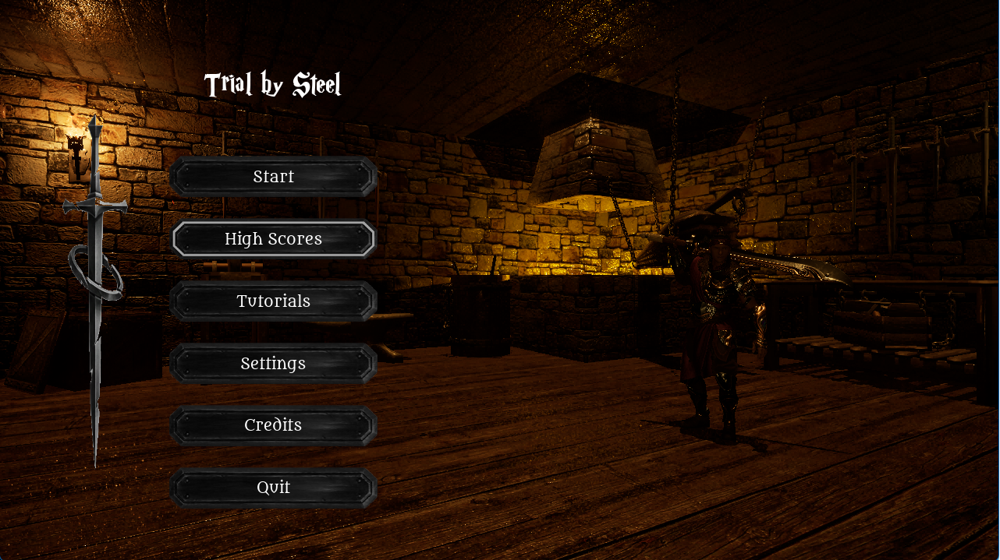

  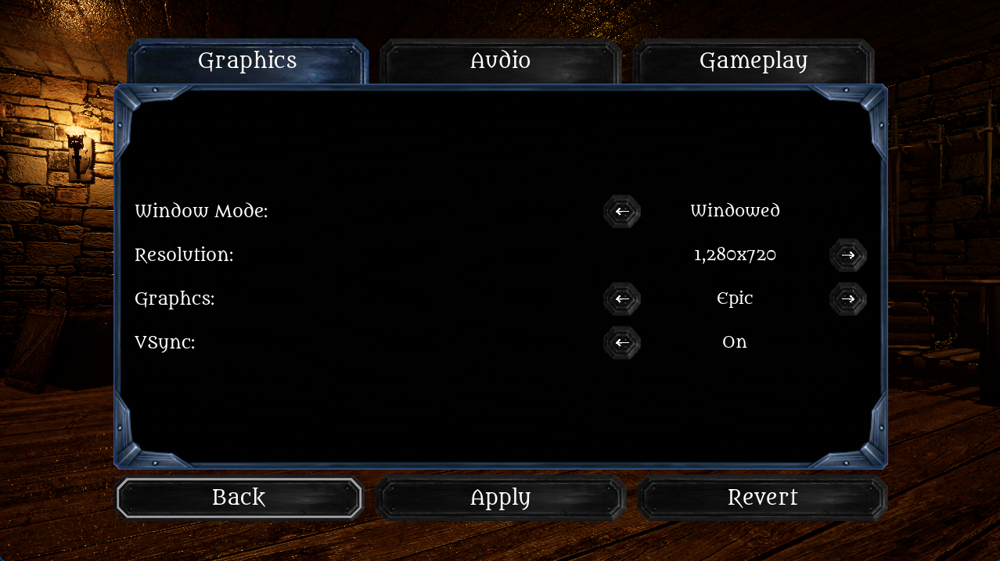

  
  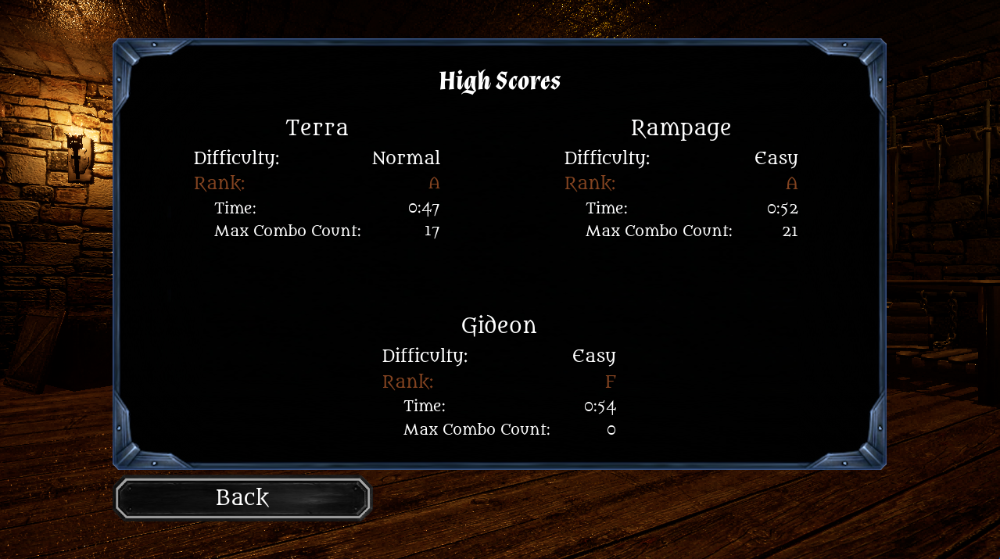

  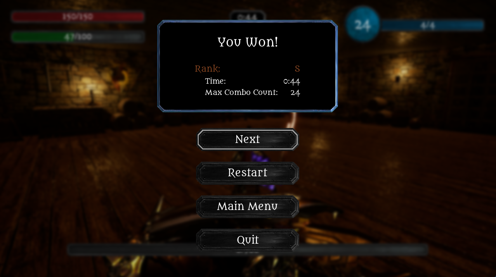

  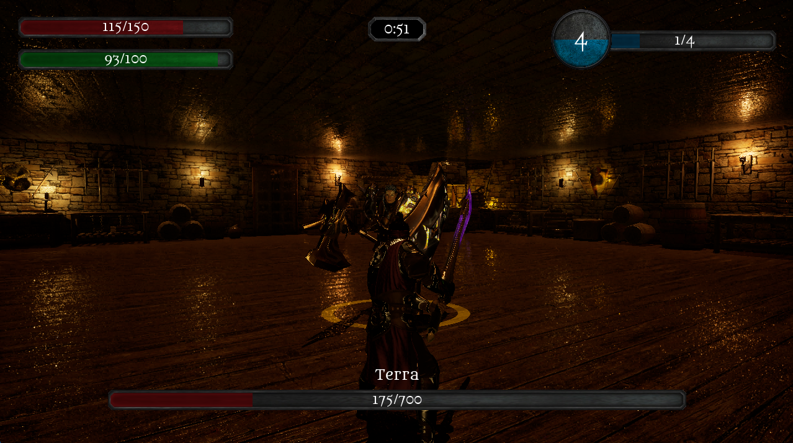

  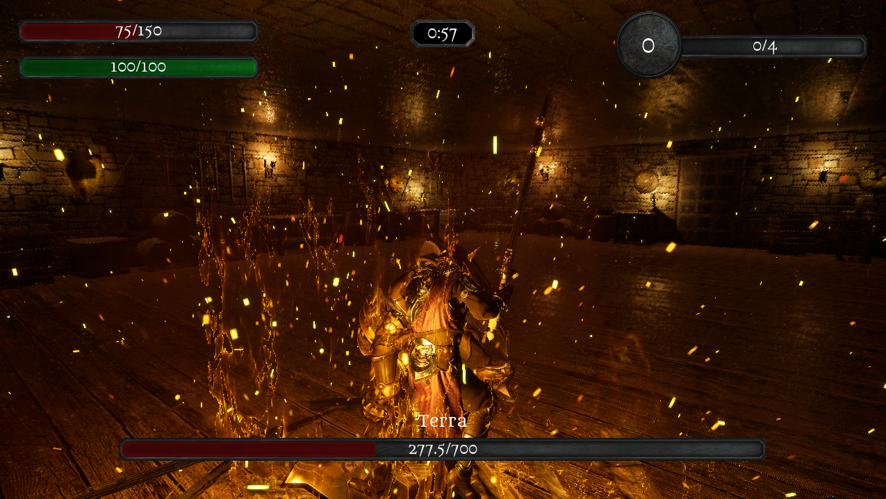

  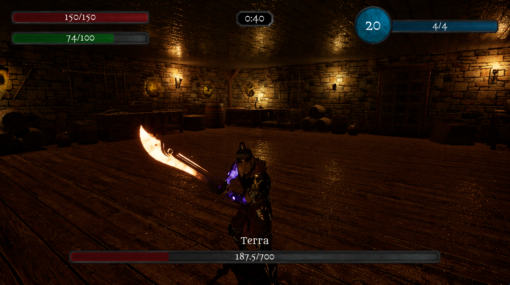

  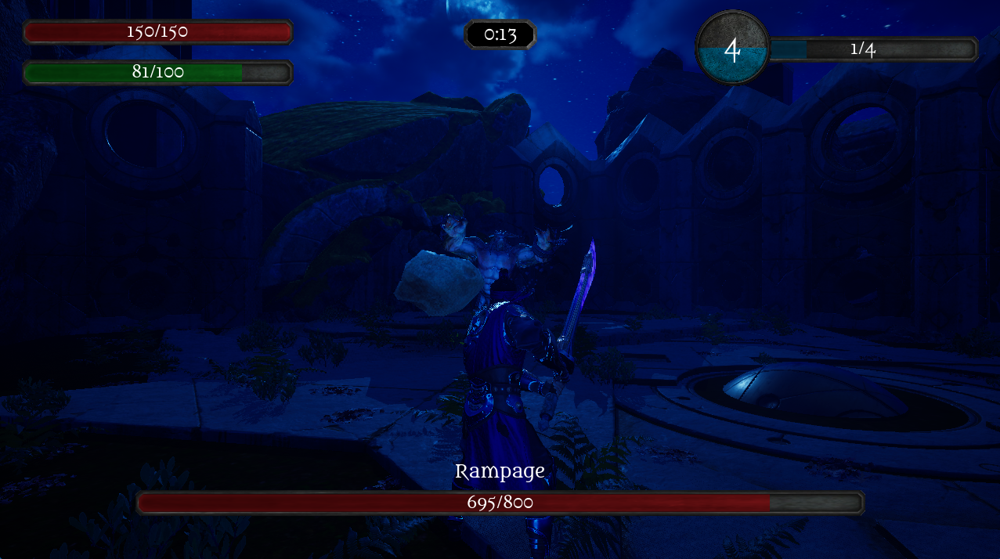

  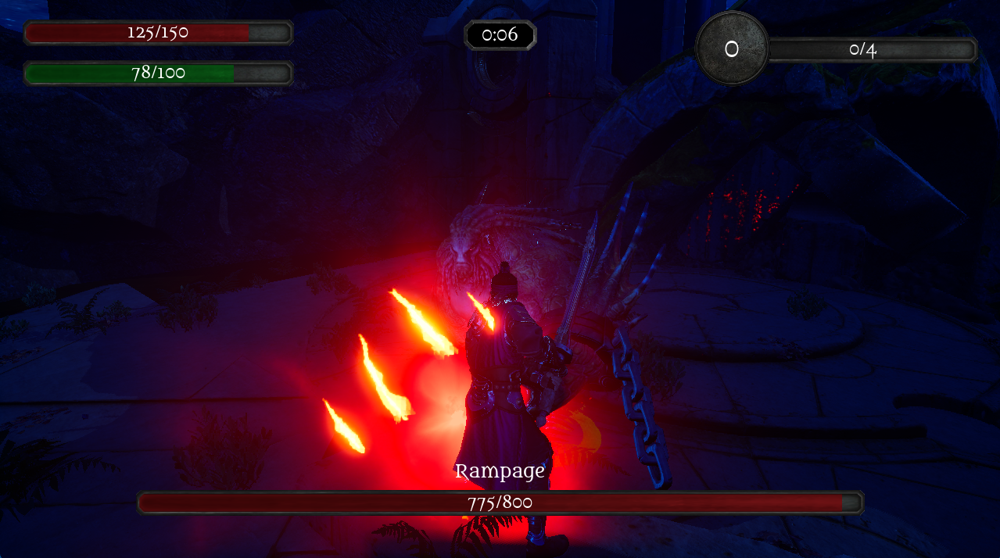

  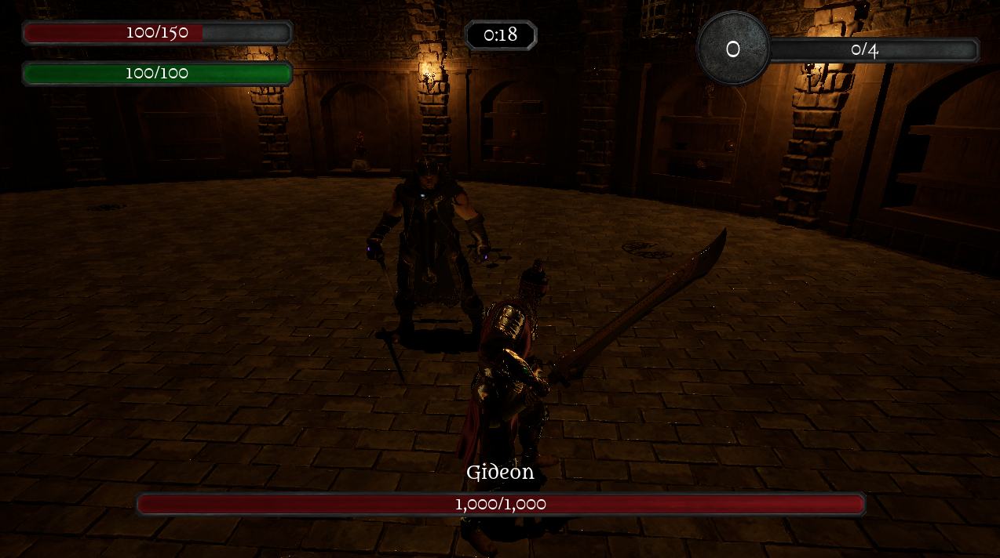

  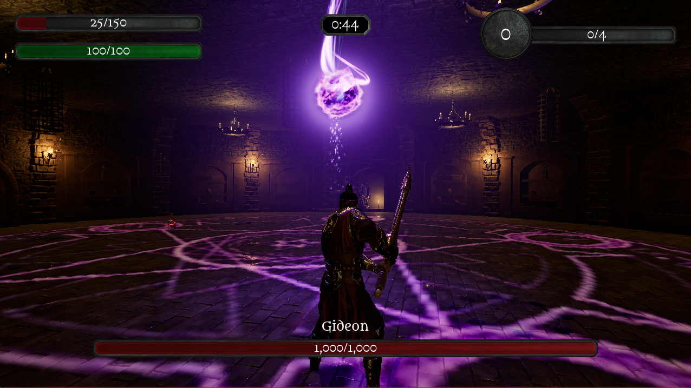

